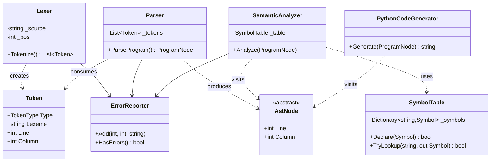

# সহজভাষা (SohojBhasha): Building a Bangla Toy Language Compiler in C#
### A Complete Implementation Handbook for CSE-4114 (Compiler Design & Construction Sessional)

---

## How to Use This Document

This handbook takes you from "I know C# but not compilers" to a finished, demoable Bangla-to-Python compiler. Read it top to bottom once, then use it as a reference while you implement each phase. One example program is carried through the entire document so grammar, parser, AST, semantics, and code generation all stay consistent with each other — copy that consistency into your own project.

The running example, used everywhere below:

```
সংখ্যা x = 10;
সংখ্যা y = 20;

যদি (x < y) {
    দেখাও(x + y);
} অন্যথায় {
    দেখাও(x);
}

যতক্ষণ (x < 50) {
    x = x + 5;
}
```

---

## Part 1 — Language Design

### 1.1 Naming the language

Call it **সহজভাষা** ("SohojBhasha" — "simple language"), file extension `.sb`. It's original, pronounceable, and honestly describes the goal: a small, readable language for teaching programming concepts in Bangla. (You may rename it, but keep the name distinct from existing languages and keep it consistent across code, docs, and the presentation.)

### 1.2 Language pitch (why it exists)

Most first programming languages a Bangladeshi student meets — C, Python, Java — use English keywords. That's a real, if modest, extra layer of cognitive load for an absolute beginner: they're learning *programming* and *English syntax words* simultaneously. SohojBhasha removes the English-keyword layer for the first few weeks of learning, so a total beginner (a school student, a non-CS-major, a rural learner) can focus purely on the ideas — variables, conditionals, loops — using words in their first language.

Be realistic in how far you take this claim:
- **What SohojBhasha is now:** a toy, single-file, non-optimizing compiler that demonstrates the full compiler pipeline for an academic project.
- **What it is not (yet):** a production language, a replacement for Python/Java, or a claim that Bangla keywords alone teach programming.
- **Future vision:** a richer standard library, functions, arrays, an IDE with Bangla error messages, and eventually a broader Bangla developer-tooling ecosystem — explicitly framed as future work, not current scope.

### 1.3 Core design principles

1. Small surface area — every construct must be implementable and testable within a semester.
2. One keyword, one meaning — no overloaded syntax.
3. Familiar C-like block structure (`{ }`, `;`) so the *shape* of code is easy to explain, only the *words* change.
4. Every language rule has a corresponding grammar rule, AST node, and code-generation rule — no "hidden" behavior.

### 1.4 Lexical elements

**Keywords**

| Bangla keyword | Meaning | English equivalent |
|---|---|---|
| `সংখ্যা` | integer declaration | `int` |
| `ভগ্নাংশ` | float declaration | `float` |
| `যদি` | if | `if` |
| `অন্যথায়` | else | `else` |
| `যতক্ষণ` | while | `while` |
| `দেখাও` | print | `print` |
| `সত্য` | boolean literal true | `true` |
| `মিথ্যা` | boolean literal false | `false` |

(Booleans are optional stretch scope — see §1.5 on choosing exactly two data types.)

**Identifiers**: start with a Bangla letter or ASCII letter/underscore, followed by letters, digits, or underscores. Supporting Unicode identifiers (Bangla variable names, not just Bangla keywords) is a nice touch but optional — decide early and document the decision, since it affects the lexer's character-classification code.

**Literals**
- Integer literal: `[0-9]+`
- Float literal: `[0-9]+ '.' [0-9]+`
- (No string literals in v1 — keeps the type system and `দেখাও` simple. Add later if time allows.)

**Operators**: `+ - * / = == != < > <= >=`

**Punctuation**: `( ) { } ;`

**Comments**: `// line comment` — simplest to lex, skip to end of line.

**Whitespace**: spaces, tabs, newlines are insignificant except for terminating comments and tracking line numbers.

### 1.5 Choosing exactly two data types

Requirement is "at least two." Recommended pair: **সংখ্যা (int)** and **ভগ্নাংশ (float)**, not int/boolean. Reasoning:

- Arithmetic and operator precedence (a mandatory feature) is naturally demonstrated with numeric types; booleans don't need precedence rules of their own.
- int/float forces you to implement **real type-checking and coercion rules** (can an int be assigned to a float variable? can you add int + float?), which is exactly what a "type checking" requirement is testing for. int/boolean by contrast makes type checking almost trivial (they're never interchangeable), which is a weaker demonstration of the concept.
- Conditions (`x < y`) still produce a truth value internally for `if`/`while`, but you don't need a *named, declarable* boolean type to support that — the condition sub-grammar can produce an internal boolean without it being one of your "two data types." This keeps the type system small while still satisfying every mandatory feature.

If your team prefers int/boolean instead, that's a valid alternative — just document the same reasoning either way; the important thing is a *deliberate, justified* choice, not which pair you pick.

### 1.6 Type-compatibility rules

Given `সংখ্যা x = 10;` and `ভগ্নাংশ y = 5.5;`:

- `x = y;` → **invalid** (narrowing: assigning a float to an int variable loses precision implicitly) → semantic error.
- `y = x;` → **valid** (widening: int → float is a safe implicit coercion) — generated Python: `y = x`, which behaves correctly because Python ints coerce to float automatically at runtime.
- `x = x + 1;` → valid, int + int = int.
- `y = x + 1.5;` → valid, int + float = float (result type is float; y accepts float).
- `x = x + 1.5;` → **invalid**, int variable can't receive a float-typed expression result.
- `যদি (x + y)` → **invalid**, a condition position requires a comparison (`<, >, ==, ...`) not a bare numeric expression — this is a semantic rule your analyzer should check, not just a grammar rule, because grammar alone can't express "the condition must be boolean-shaped."

### 1.7 Statements and semantics, defined precisely

| Construct | Meaning |
|---|---|
| `সংখ্যা x = 10;` | Declare `x` as int in current scope; symbol table entry created; type = Int; initialized. Redeclaring `x` in the same scope → semantic error "duplicate declaration." |
| `x = expr;` | Look up `x` in symbol table (must exist — else "undefined variable"); check `expr`'s type is assignment-compatible with `x`'s declared type; emit assignment. |
| `যদি (cond) { ... } অন্যথায় { ... }` | Evaluate `cond` (must be a comparison expression); execute the first block if true, else the second (else optional). |
| `যতক্ষণ (cond) { ... }` | Repeat block while `cond` is true. |
| `দেখাও(expr);` | Evaluate `expr`, print its value. |
| `{ ... }` | A block introduces no new scope in v1 (keep scoping simple — see note below) but *is* the unit that `if`/`while` operate on. |

**Scope note:** For a toy compiler, the simplest defensible choice is one global scope for the whole program (no block-level shadowing). Document this explicitly as a deliberate simplification — it avoids a whole class of scope-stack complexity that isn't required by the rubric, while still letting you demonstrate a real symbol table.

**Valid/invalid examples**

```
✔ সংখ্যা x = 10;  x = x + 1;
✘ x = 10;                       // undefined variable 'x'
✘ সংখ্যা x = 10; সংখ্যা x = 5;    // duplicate declaration of 'x'
✘ সংখ্যা x = 10; x = 5.5;        // type mismatch: float → int
✔ ভগ্নাংশ y = 5.5; y = 10;       // int → float widening, OK
✘ যদি (x + y) { ... }            // condition must be a comparison
```

---

## Part 2 — Complete BNF Grammar

This grammar must match your parser 1:1 — when you change one, change the other immediately.

```bnf
<program>          ::= <statement-list>

<statement-list>   ::= <statement> <statement-list>
                      | ε

<statement>        ::= <declaration>
                      | <assignment>
                      | <if-statement>
                      | <while-statement>
                      | <print-statement>

<declaration>       ::= <type> <identifier> "=" <expression> ";"

<type>              ::= "সংখ্যা" | "ভগ্নাংশ"

<assignment>        ::= <identifier> "=" <expression> ";"

<if-statement>       ::= "যদি" "(" <condition> ")" <block>
                        | "যদি" "(" <condition> ")" <block> "অন্যথায়" <block>

<while-statement>    ::= "যতক্ষণ" "(" <condition> ")" <block>

<print-statement>    ::= "দেখাও" "(" <expression> ")" ";"

<block>              ::= "{" <statement-list> "}"

<condition>          ::= <expression> <rel-op> <expression>

<rel-op>             ::= "==" | "!=" | "<" | ">" | "<=" | ">="

<expression>         ::= <term> (("+" | "-") <term>)*

<term>               ::= <factor> (("*" | "/") <factor>)*

<factor>             ::= <integer-literal>
                        | <float-literal>
                        | <identifier>
                        | "(" <expression> ")"

<identifier>         ::= <letter> (<letter> | <digit> | "_")*

<integer-literal>    ::= <digit>+

<float-literal>      ::= <digit>+ "." <digit>+
```

Notes:
- `<expression>` → `<term>` → `<factor>` is the classic three-level grammar that encodes precedence directly into the grammar's *shape*: `*`/`/` bind tighter than `+`/`-` because `<term>` is nested one level deeper. This is the same trick you'll mirror exactly in the parser (§4).
- `<condition>` is deliberately **not** part of `<expression>` — comparisons can only appear inside `if`/`while` parentheses, not as general sub-expressions (`x = (x < y);` is invalid). That keeps the "condition must be boolean-shaped" semantic rule from §1.6 enforceable at the grammar level too.

---

## Part 3 — Compiler Architecture

```
Bangla Source (.sb)
        │
        ▼
  ┌───────────┐
  │   Lexer   │   chars → tokens
  └───────────┘
        │
        ▼
     Tokens
        │
        ▼
  ┌───────────┐
  │  Parser   │   tokens → AST (recursive descent)
  └───────────┘
        │
        ▼
       AST
        │
        ▼
  ┌───────────────────┐
  │ Semantic Analyzer  │   type-check, build/consult symbol table
  └───────────────────┘
        │
        ▼
   Validated AST
        │
        ▼
  ┌────────────────┐
  │ Code Generator  │   AST → Python source (string emission)
  └────────────────┘
        │
        ▼
    output.py
        │
        ▼
    Python VM → program output
```

There is no separate "intermediate representation" step in this scope — the **validated AST itself is the IR**. Adding a true IR (e.g., three-address code) is reasonable *optional* extra work, but is not required to satisfy the rubric and adds real complexity; call it out explicitly as an omission if a grader asks.

### Tracing the example through every phase

Source line: `x = x + 5;` (from the `যতক্ষণ` loop body).

1. **Tokens:** `IDENTIFIER(x) ASSIGN IDENTIFIER(x) PLUS INTEGER(5) SEMICOLON`
2. **AST:** `AssignmentNode(name="x", value=BinaryExpressionNode(op=+, left=IdentifierNode("x"), right=LiteralNode(5)))`
3. **Semantic analysis:** look up `x` → found, type Int. Evaluate RHS type: Int (identifier) + Int (literal) = Int. Int → Int assignment: compatible. No error.
4. **Code generation:** `x = x + 5`

---

## Part 4 — C# Project Structure

```
BanglaCompiler/
├── BanglaCompiler.sln
├── src/BanglaCompiler/
│   ├── Program.cs                     # CLI entry point
│   ├── Lexer/
│   │   ├── TokenType.cs
│   │   ├── Token.cs
│   │   └── Lexer.cs
│   ├── Parser/
│   │   └── Parser.cs
│   ├── AST/
│   │   ├── AstNode.cs
│   │   ├── StatementNodes.cs
│   │   └── ExpressionNodes.cs
│   ├── Semantic/
│   │   ├── Symbol.cs
│   │   ├── SymbolTable.cs
│   │   └── SemanticAnalyzer.cs
│   ├── CodeGeneration/
│   │   └── PythonCodeGenerator.cs
│   ├── Errors/
│   │   ├── CompilerError.cs
│   │   └── ErrorReporter.cs
│   └── Utils/
├── examples/
│   ├── basic.sb
│   ├── arithmetic.sb
│   ├── condition.sb
│   └── loop.sb
├── tests/
│   └── BanglaCompiler.Tests/
├── docs/
└── README.md
```

| Folder / class | Responsibility |
|---|---|
| `Lexer/` | Turns raw source text into a flat `List<Token>`. Owns all character-level decisions (Unicode, keyword table, number scanning). |
| `Parser/` | Consumes tokens, applies the BNF grammar, produces an `AstNode` tree. Owns *no* type logic — only syntax. |
| `AST/` | Plain data classes representing program structure. No behavior beyond maybe a `ToString()`/pretty-printer for `--ast` debugging. |
| `Semantic/` | Walks the AST, maintains the `SymbolTable`, enforces every rule from §1.6–1.7. Produces the *same* AST, annotated or validated, or throws collected `CompilerError`s. |
| `CodeGeneration/` | Walks the validated AST and emits Python text. Owns *no* type-checking — it trusts the semantic analyzer already validated everything. |
| `Errors/` | `CompilerError` (message, line, column, severity) and `ErrorReporter` (collects and prints all errors instead of throwing on the first one). |
| `Utils/` | Shared helpers (e.g., a small Unicode range table for Bangla letters). |

This is the standard compiler layering: **each phase only talks to the phase adjacent to it**, and no phase reaches "backwards." Keep that discipline — it is what makes the project debuggable and gradeable module-by-module.

---

## Part 5 — Lexer

### Token types

```csharp
public enum TokenType
{
    // Literals & identifiers
    Identifier, IntegerLiteral, FloatLiteral,

    // Keywords
    KwSongkha, KwVognangsho, KwJodi, KwOnnothay, KwJotokhon, KwDekhao,

    // Operators
    Plus, Minus, Multiply, Divide, Assign,
    Equal, NotEqual, Greater, Less, GreaterEqual, LessEqual,

    // Punctuation
    LeftParen, RightParen, LeftBrace, RightBrace, Semicolon,

    // Control
    EndOfFile, Invalid
}
```

### Token

```csharp
public readonly struct Token
{
    public TokenType Type { get; }
    public string Lexeme { get; }
    public int Line { get; }
    public int Column { get; }

    public Token(TokenType type, string lexeme, int line, int column)
    {
        Type = type; Lexeme = lexeme; Line = line; Column = column;
    }
}
```

Storing `Line`/`Column` on every token is what makes every later error message ("line 4, column 12: undefined variable") possible — capture it once here and thread it through the AST nodes too.

### Core scanning loop

```csharp
public class Lexer
{
    private readonly string _source;
    private int _pos = 0, _line = 1, _col = 1;

    private static readonly Dictionary<string, TokenType> Keywords = new()
    {
        ["সংখ্যা"] = TokenType.KwSongkha,
        ["ভগ্নাংশ"] = TokenType.KwVognangsho,
        ["যদি"] = TokenType.KwJodi,
        ["অন্যথায়"] = TokenType.KwOnnothay,
        ["যতক্ষণ"] = TokenType.KwJotokhon,
        ["দেখাও"] = TokenType.KwDekhao,
    };

    public Lexer(string source) => _source = source;

    public List<Token> Tokenize()
    {
        var tokens = new List<Token>();
        while (true)
        {
            SkipWhitespaceAndComments();
            if (IsAtEnd()) { tokens.Add(new Token(TokenType.EndOfFile, "", _line, _col)); break; }

            char c = Peek();
            if (IsIdentifierStart(c)) tokens.Add(ScanIdentifierOrKeyword());
            else if (char.IsDigit(c)) tokens.Add(ScanNumber());
            else tokens.Add(ScanOperatorOrPunctuation());
        }
        return tokens;
    }

    private bool IsIdentifierStart(char c) =>
        char.IsLetter(c) || c == '_'; // char.IsLetter is Unicode-aware, so Bangla letters qualify

    // ... ScanIdentifierOrKeyword, ScanNumber, ScanOperatorOrPunctuation, Advance/Peek helpers
}
```

Key points to explain in your report:

- **Unicode handling:** .NET's `char` is UTF-16; `char.IsLetter` already recognizes Bangla letters, so no custom Unicode table is strictly required — but Bangla conjuncts (যুক্তাক্ষর) are made of *multiple* UTF-16 code points joined by a virama. For v1, treat each keyword as a fixed known string (matched greedily, longest-match-first) rather than trying to parse conjuncts generically — this sidesteps a genuinely hard Unicode-segmentation problem that's out of scope for a toy compiler.
- **Numbers:** scan digits; if a `.` is followed by another digit, continue scanning as a float; otherwise stop (so `x.` outside a number context isn't mis-lexed).
- **Comments:** on seeing `//`, skip to `\n` without emitting a token.
- **Line/column tracking:** increment `_line` and reset `_col` on `\n`; otherwise increment `_col` per character consumed.
- **Lexical errors:** an unrecognized character (e.g., `@`) should produce `TokenType.Invalid` with the offending character as its lexeme, recorded via `ErrorReporter`, *not* thrown as an exception — this is your first line of "never crash on bad input."

---

## Part 6 — Parser (Recursive Descent)

### Why recursive descent

For a project of this size, recursive descent is the right choice because: it maps **one grammar rule → one method**, so the BNF from Part 2 is literally readable off the parser's method list; it needs no parser-generator tooling (easier to demo, debug, and explain live in a presentation); and it naturally supports hand-written, per-construct error recovery (§8), which table-driven LL or LALR parsers make much harder to customize for a student project.

### Method skeleton (mirrors the grammar exactly)

```csharp
public class Parser
{
    private readonly List<Token> _tokens;
    private int _pos = 0;
    private readonly ErrorReporter _errors;

    public ProgramNode ParseProgram()
    {
        var statements = new List<StatementNode>();
        while (!Check(TokenType.EndOfFile))
        {
            var stmt = ParseStatement();
            if (stmt != null) statements.Add(stmt);
        }
        return new ProgramNode(statements);
    }

    private StatementNode? ParseStatement()
    {
        try
        {
            return Peek().Type switch
            {
                TokenType.KwSongkha or TokenType.KwVognangsho => ParseDeclaration(),
                TokenType.Identifier => ParseAssignment(),
                TokenType.KwJodi => ParseIfStatement(),
                TokenType.KwJotokhon => ParseWhileStatement(),
                TokenType.KwDekhao => ParsePrintStatement(),
                _ => throw Error($"Unexpected token '{Peek().Lexeme}'")
            };
        }
        catch (ParseException)
        {
            Synchronize(); // error recovery, see Part 8
            return null;
        }
    }

    private ExpressionNode ParseExpression()
    {
        var left = ParseTerm();
        while (Check(TokenType.Plus) || Check(TokenType.Minus))
        {
            var op = Advance();
            var right = ParseTerm();
            left = new BinaryExpressionNode(left, op.Type, right);
        }
        return left;
    }

    private ExpressionNode ParseTerm()
    {
        var left = ParseFactor();
        while (Check(TokenType.Multiply) || Check(TokenType.Divide))
        {
            var op = Advance();
            var right = ParseFactor();
            left = new BinaryExpressionNode(left, op.Type, right);
        }
        return left;
    }

    private ExpressionNode ParseFactor()
    {
        if (Check(TokenType.IntegerLiteral) || Check(TokenType.FloatLiteral))
            return new LiteralNode(Advance());
        if (Check(TokenType.Identifier))
            return new IdentifierNode(Advance());
        if (Match(TokenType.LeftParen))
        {
            var expr = ParseExpression();
            Expect(TokenType.RightParen, "expected ')'");
            return expr;
        }
        throw Error("expected a number, identifier, or '('");
    }
}
```

### Operator precedence, explained with the example

`x + y * 5` parses as `x + (y * 5)` because `ParseExpression` calls `ParseTerm` first (not the other way around): the `*` between `y` and `5` gets fully consumed *inside* the recursive call to `ParseTerm`, before control ever returns to the `+`-handling loop in `ParseExpression`. The grammar nesting from Part 2 (`expression → term → factor`) and this call nesting are the same idea expressed two ways — that correspondence is worth a diagram in your report.

---

## Part 7 — AST Design

```
AstNode (abstract)
├── ProgramNode
├── StatementNode (abstract)
│   ├── DeclarationNode(Type, Name, InitExpr)
│   ├── AssignmentNode(Name, ValueExpr)
│   ├── IfNode(Condition, ThenBlock, ElseBlock?)
│   ├── WhileNode(Condition, Body)
│   └── PrintNode(Expr)
└── ExpressionNode (abstract)
    ├── LiteralNode(Value, LiteralType)
    ├── IdentifierNode(Name)
    └── BinaryExpressionNode(Left, Operator, Right)
```

```csharp
public abstract record AstNode(int Line, int Column);

public abstract record StatementNode(int Line, int Column) : AstNode(Line, Column);
public abstract record ExpressionNode(int Line, int Column) : AstNode(Line, Column);

public record AssignmentNode(string Name, ExpressionNode Value, int Line, int Column)
    : StatementNode(Line, Column);

public record BinaryExpressionNode(ExpressionNode Left, TokenType Operator, ExpressionNode Right,
    int Line, int Column) : ExpressionNode(Line, Column);
```

Using C# `record` types (instead of raw classes with manual `Equals`/pointers) keeps nodes immutable, gives free structural equality for unit tests, and avoids the unsafe-pointer patterns the project explicitly wants avoided.

### `x = x + 5;` as a tree

```
AssignmentNode "x"
└── BinaryExpressionNode "+"
    ├── IdentifierNode "x"
    └── LiteralNode 5
```

---

## Part 8 — Symbol Table & Semantic Analysis

### Symbol table

```csharp
public enum SymbolType { Int, Float }

public record Symbol(string Name, SymbolType Type, int DeclaredLine);

public class SymbolTable
{
    private readonly Dictionary<string, Symbol> _symbols = new();

    public bool Declare(Symbol symbol) => _symbols.TryAdd(symbol.Name, symbol);
    public bool TryLookup(string name, out Symbol? symbol) => _symbols.TryGetValue(name, out symbol);
}
```

`Declare` returning `false` on a duplicate name is exactly the hook the semantic analyzer uses to raise "duplicate declaration" instead of silently overwriting.

### Semantic analyzer sketch

```csharp
public class SemanticAnalyzer
{
    private readonly SymbolTable _table = new();
    private readonly ErrorReporter _errors;

    public void Analyze(ProgramNode program)
    {
        foreach (var stmt in program.Statements) AnalyzeStatement(stmt);
    }

    private void AnalyzeStatement(StatementNode stmt)
    {
        switch (stmt)
        {
            case DeclarationNode d:
                var initType = ResolveType(d.InitExpr);
                if (!_table.Declare(new Symbol(d.Name, d.DeclaredType, d.Line)))
                    _errors.Add(d.Line, d.Column, $"Variable '{d.Name}' is already declared.");
                else if (!IsAssignable(d.DeclaredType, initType))
                    _errors.Add(d.Line, d.Column, $"Cannot assign {initType} to {d.DeclaredType} variable '{d.Name}'.");
                break;

            case AssignmentNode a:
                if (!_table.TryLookup(a.Name, out var sym))
                    _errors.Add(a.Line, a.Column, $"Variable '{a.Name}' is not declared.");
                else
                {
                    var rhsType = ResolveType(a.Value);
                    if (!IsAssignable(sym!.Type, rhsType))
                        _errors.Add(a.Line, a.Column, $"Type mismatch: cannot assign {rhsType} to {sym.Type} '{a.Name}'.");
                }
                break;

            // IfNode, WhileNode: analyze Condition (must be a comparison), then recurse into blocks
            // PrintNode: just resolve the expression's type (any numeric type is printable)
        }
    }

    private bool IsAssignable(SymbolType target, SymbolType source) =>
        target == source || (target == SymbolType.Float && source == SymbolType.Int); // widening only
}
```

`x = 20;` with no prior declaration produces:

```
Semantic Error (line 1, col 1): Variable 'x' is not declared.
```

Because the analyzer collects errors into `ErrorReporter` rather than throwing, it can report **every** semantic problem in one pass, not just the first — worth demonstrating live in your presentation.

---

## Part 9 — Syntax Error Recovery

Panic-mode recovery, in plain terms: when the parser hits a token it can't make sense of, it (1) records the error with line/column, (2) **discards tokens** — without trying to parse them — until it finds a safe restart point (a `;` or a `}`), and (3) resumes parsing normally from there. The parser doesn't try to *guess* what was meant; it just skips the damaged region and keeps going, so it can still find and report *other, unrelated* errors later in the file.

```csharp
private void Synchronize()
{
    while (!Check(TokenType.EndOfFile))
    {
        if (Previous().Type == TokenType.Semicolon) return;     // recovered
        if (Check(TokenType.RightBrace)) return;                // recovered at block end
        Advance();
    }
}
```

Example:

```
সংখ্যা x = 10
সংখ্যা y = 20;
```

The parser expects `;` after `10`, doesn't find it (sees `সংখ্যা` instead), reports:

```
Syntax Error (line 1): expected ';' after declaration, found 'সংখ্যা'
```

then synchronizes by skipping forward to the next `;` — which happens to be the end of the *second* declaration — and resumes. The result: one clear error message, and the compiler still attempts to process the rest of the file instead of stopping dead.

---

## Part 10 — Code Generation (Python target)

Python is the recommended target over Java because: no compile step on the *generated* code (fewer moving parts in your live demo), whitespace-based blocks map almost one-to-one onto SohojBhasha's `{ }` blocks (you're translating structure, not fighting against Java's verbosity), and Python's dynamic typing means you don't have to *also* emit Java type declarations correctly — your semantic analyzer has already done the real type checking, so codegen can stay a thin, mechanical text emitter.

### Construct-by-construct mapping

| SohojBhasha | Python |
|---|---|
| `সংখ্যা x = 10;` | `x = 10` |
| `ভগ্নাংশ y = 5.5;` | `y = 5.5` |
| `x = x + y;` | `x = x + y` |
| `যদি (x < y) { A } অন্যথায় { B }` | `if x < y:\n    A\nelse:\n    B` |
| `যতক্ষণ (x < 50) { A }` | `while x < 50:\n    A` |
| `দেখাও(x);` | `print(x)` |

### Generator sketch

```csharp
public class PythonCodeGenerator
{
    private readonly StringBuilder _sb = new();
    private int _indent = 0;

    public string Generate(ProgramNode program)
    {
        foreach (var stmt in program.Statements) EmitStatement(stmt);
        return _sb.ToString();
    }

    private void EmitStatement(StatementNode stmt)
    {
        switch (stmt)
        {
            case DeclarationNode d: EmitLine($"{d.Name} = {EmitExpr(d.InitExpr)}"); break;
            case AssignmentNode a:  EmitLine($"{a.Name} = {EmitExpr(a.Value)}"); break;
            case PrintNode p:       EmitLine($"print({EmitExpr(p.Expr)})"); break;
            case IfNode i:
                EmitLine($"if {EmitExpr(i.Condition)}:");
                EmitBlock(i.ThenBlock);
                if (i.ElseBlock != null) { EmitLine("else:"); EmitBlock(i.ElseBlock); }
                break;
            case WhileNode w:
                EmitLine($"while {EmitExpr(w.Condition)}:");
                EmitBlock(w.Body);
                break;
        }
    }

    private void EmitBlock(List<StatementNode> body)
    {
        _indent++;
        foreach (var s in body) EmitStatement(s);
        _indent--;
    }

    private void EmitLine(string text) => _sb.AppendLine(new string(' ', _indent * 4) + text);
}
```

### Full worked example

SohojBhasha:

```
সংখ্যা x = 10;
সংখ্যা y = 20;

যদি (x < y) {
    দেখাও(x + y);
} অন্যথায় {
    দেখাও(x);
}
```

Generated `output.py`:

```python
x = 10
y = 20
if x < y:
    print(x + y)
else:
    print(x)
```

Running it: `python output.py` → `30`.

---

## Part 11 — CLI

```bash
dotnet run --project src/BanglaCompiler -- examples/basic.sb
dotnet run --project src/BanglaCompiler -- examples/basic.sb --tokens
dotnet run --project src/BanglaCompiler -- examples/basic.sb --ast
dotnet run --project src/BanglaCompiler -- examples/basic.sb --output output.py
```

`Program.cs` responsibilities: read the source file (guard: file exists, non-empty), run Lexer → Parser → SemanticAnalyzer → CodeGenerator in sequence, **stop and print collected errors** if any phase's `ErrorReporter` is non-empty (don't cascade a broken AST into codegen), otherwise write `output.py` and print a success message. `--tokens`/`--ast` flags just dump the intermediate lists/tree for debugging and for your presentation's "show the internals" moment.

---

## Part 12 — Robustness & Defensive Programming

Non-negotiable habits, since "never crash on bad input" is a hard requirement:

- **Safe token access:** never index `_tokens[_pos]` directly without bounds-checking; wrap in a `Peek()`/`Advance()` pair that returns `EndOfFile` past the end instead of throwing `IndexOutOfRangeException`.
- **Null checking:** enable C# nullable reference types (`<Nullable>enable</Nullable>` in the `.csproj`) so the compiler itself flags places you forgot to check for `null`.
- **Empty files:** an empty source string should lex to just `EndOfFile` and parse to an empty `ProgramNode` — not throw.
- **Unexpected EOF:** e.g., an unterminated `{` block — the parser should report "expected '}' but reached end of file" rather than looping forever or throwing an unhandled exception.
- **Invalid Unicode / stray characters:** lexer emits `TokenType.Invalid` (§5) rather than throwing.
- **Centralized error collection:** every phase reports through the same `ErrorReporter`, and `Program.cs` is the *only* place that decides whether to halt. Individual phases never call `Environment.Exit` or let an exception escape uncaught — wrap the top-level pipeline call in `Program.cs` in a final `try/catch (Exception ex)` that prints "Internal compiler error" as an absolute last resort, so a truly unforeseen bug never shows the user a raw .NET stack trace.

---

## Part 13 — Testing Strategy

Aim for 15–20+ cases across these categories (a good baseline distribution):

**Lexer (4–5 cases):** all keywords recognized; identifiers with mixed Bangla/ASCII; integer vs. float literal boundary (`5.` should not silently become `5`); comments correctly skipped; an invalid character (`@`) flagged without crashing.

**Parser (4–5 cases):** valid declaration; missing semicolon (recovery check); `যদি` without `অন্যথায়`; nested `যদি` inside `যতক্ষণ`; precedence check — parse `2 + 3 * 4` and assert the AST shape is `+(2, *(3,4))`, not `*(+(2,3), 4)`.

**Semantic (4–5 cases):** undefined variable; duplicate declaration; int←float type mismatch; float←int OK (widening); condition using a bare expression instead of a comparison.

**Code generation (2–3 cases):** declaration emits correct Python; `if/else` indentation is exactly 4 spaces per level; nested `while` inside `if` indents correctly (indentation bugs are the #1 way to generate *syntactically invalid* Python, so test this explicitly by running the emitted file through `python -m py_compile`).

**End-to-end (3–4 cases):** the running example compiles, runs, and produces the expected printed output; a file with one syntax error *and* valid code after it still compiles the valid part; a file with only semantic errors produces zero lines of Python output (nothing partially emitted).

Use a standard C# test framework (xUnit or NUnit) under `tests/BanglaCompiler.Tests`, one test class per phase, so individual members can own and demo their own test suite.

---

## Part 14 — Git & Team Workflow

Suggested module split (but everyone should be able to explain every phase in the presentation):

| Member | Owns |
|---|---|
| A | Lexer |
| B | Parser + AST |
| C | Semantic Analysis + Symbol Table |
| D | Code Generation + Testing + CLI |

Branching: `main` (always working/demoable) ← `dev` ← per-feature branches (`feature/lexer-comments`, `feature/parser-if-else`). Merge via pull request, even solo, so there's a reviewable history.

Commit message convention (Conventional Commits style):

```
feat: implement lexer tokenization for keywords
feat: add recursive descent parser for expressions
feat: add AST expression nodes
feat: implement symbol table with duplicate detection
feat: add type checking for assignments
feat: implement Python code generator for if/else
test: add parser precedence test cases
fix: recover parser after missing semicolon
docs: add BNF grammar to README
```

For "3 meaningful pushes per week per member": meaningful means each push corresponds to a genuinely separate, describable unit of work (one grammar rule implemented, one bug fixed, one test class added) — not three commits that just re-save the same file. A simple team habit that satisfies this naturally: commit after every passing test, not at the end of a multi-hour session.

---

## Part 15 — UML



Relationships to call out explicitly in your report: **inheritance** (`DeclarationNode : StatementNode : AstNode`), **composition** (`ProgramNode` owns its `List<StatementNode>` — they don't outlive the tree), **association** (`SemanticAnalyzer` uses a `SymbolTable` but doesn't own its lifetime beyond one `Analyze` call), **dependency** (every phase depends on `ErrorReporter` without `ErrorReporter` knowing anything about them).

---

## Part 16 — Development Roadmap (10 Milestones)

| # | Milestone | Goal | Key output | Common mistake to avoid |
|---|---|---|---|---|
| 1 | Language design | Finalize keywords, BNF | This document's Part 1–2 | Designing syntax before grammar — leads to an unparseable grammar later |
| 2 | Project setup + Lexer | Tokenize all constructs | `Lexer.Tokenize()` passing lexer tests | Mixing parsing logic into the lexer |
| 3 | Parser + expressions | Precedence-correct expression parsing | `ParseExpression/Term/Factor` | Skipping the grammar and writing ad-hoc `if` chains |
| 4 | AST | Full node hierarchy | AST classes + pretty-printer | Reusing Token objects as AST nodes instead of a real tree |
| 5 | Symbol table + semantics | Type checking, undeclared/duplicate detection | `SemanticAnalyzer` | Doing type checks inside the parser |
| 6 | Control flow | `if/else`, `while` end-to-end | Full statement parsing + AST + semantics | Forgetting `else` is optional in the grammar |
| 7 | Code generation | Correct, runnable Python | `PythonCodeGenerator` | Off-by-one indentation bugs (test with `py_compile`) |
| 8 | Error recovery | Panic-mode sync | `Synchronize()` + multi-error reports | Recovery that swallows *all* remaining tokens instead of stopping at `;`/`}` |
| 9 | Testing + edge cases | 15–20+ passing tests | `tests/` suite | Only testing valid programs, never invalid ones |
| 10 | Docs + UML + presentation | Final report, diagrams, demo script | `docs/`, this handbook's Part 18–19 | Writing docs after forgetting design decisions — document *as you go* |

---

## Part 17 — Learning Roadmap (only what this project needs)

```
C# fundamentals & OOP  → you're writing every phase as classes
Collections (Dictionary/List) → symbol table, token stream
Regular expressions / char classification → recognizing tokens
Context-Free Grammars (BNF) → §2, defines exactly what's parseable
Recursive descent parsing → §6, turns grammar rules into methods
AST design → §7, the shared data structure between phases
Symbol tables & scope → §8, name resolution
Type systems / type checking → §8, semantic rules
Code generation (template/tree-walking) → §10, simplest form of codegen
```

Deliberately **not** required: DFA/NFA construction by hand (a hand-written lexer covers this implicitly), LL/LR parser tables (recursive descent sidesteps needing them), register allocation, optimization passes, or any IR beyond the AST itself. If your course covers these theoretically, understanding them helps you explain *why* recursive descent and a tree-walking generator are valid simplifications — but building them is out of scope here.

---

## Part 18 — Common Mistakes to Avoid

| Mistake | Why it hurts | Fix |
|---|---|---|
| Starting with code generation before parsing works | Nothing to generate from; wastes early weeks | Follow the pipeline order in the roadmap |
| Over-designing the language (adding functions, arrays, strings early) | Blows the semester budget | Ship the required minimum first; extensions are optional/future work |
| Writing parser code without a written grammar | Grammar and code drift apart, becomes unmaintainable | Always update Part 2's BNF *first*, then the matching method |
| Mixing lexer and parser responsibilities | Hard to test either in isolation | Lexer only tokenizes; parser only structures tokens |
| Skipping the AST and generating code straight from tokens | No place to do type-checking; fragile | Always materialize a real AST |
| Ignoring type checking "because Python doesn't need it" | Fails the mandatory type-checking requirement | Type-check in Semantic Analysis regardless of target language |
| No error recovery — first error halts everything | Fails the mandatory recovery requirement, weak demo | Implement `Synchronize()` from Part 9 |
| Generating Python with inconsistent indentation | Generated code doesn't even run — worst possible demo failure | Centralize indentation in one `EmitLine` helper; test with `py_compile` |
| No line/column info on errors | Errors are useless to a user | Carry `Line`/`Column` from `Token` through every `AstNode` |
| Compiler throws raw exceptions on bad input | Looks broken in front of graders | Defensive programming per Part 12 |
| Copying an existing language's syntax wholesale | Against the assignment's spirit; weak pitch | Design deliberately, as in Part 1, and be ready to justify choices |

---

## Part 19 — Live Demonstration Script (5–10 minutes)

1. **(30s) Motivation** — one sentence on the language barrier problem (§1.2), no exaggeration.
2. **(1m) Show source** — open `examples/loop.sb`, walk through the syntax briefly.
3. **(1m) Run the compiler** — `dotnet run -- examples/loop.sb --tokens` to show the token stream.
4. **(1m) Show the AST** — `--ast` flag, point out the precedence-correct nesting for one expression.
5. **(1m) Semantic pass** — mention (or show, if you log it) that the symbol table now has `x: Int`.
6. **(1m) Generate + run Python** — `--output output.py` then `python output.py`, show real output.
7. **(1m) Syntax error demo** — remove a `;` from the file, re-run, show the recovery message *and* that the rest of the file still gets reported on.
8. **(1m) Semantic error demo** — reference an undeclared variable, show the clean error message.
9. **(1m) Wrap-up** — architecture recap diagram (Part 3), and 2–3 concrete future-roadmap items (functions, arrays, string type).

Keep the terminal font large, pre-clear scrollback, and have all example files already saved so nothing is typed live except the one intentional error.

---

## Part 20 — Final Report Structure

1. **Introduction** — one paragraph, what was built.
2. **Project Motivation** — the language-barrier problem, scoped honestly.
3. **Language Pitch** — SohojBhasha's name, goal, audience.
4. **Real-World Relevance** — §1.2, current vs. future framed separately.
5. **Language Design** — Part 1 in full.
6. **Syntax and Semantics** — Part 1.7, valid/invalid examples.
7. **BNF Grammar** — Part 2, unmodified from what the parser implements.
8. **Compiler Architecture** — Part 3 diagram + traced example.
9. **Lexical Analysis** — Part 5, with a code excerpt and its test results.
10. **Syntax Analysis** — Part 6, with the precedence explanation.
11. **AST** — Part 7, tree diagram for at least two example programs.
12. **Semantic Analysis** — Part 8, all detected-error categories with examples.
13. **Error Handling** — Parts 9 and 12 together.
14. **Code Generation** — Part 10, full mapping table + one complete traced example.
15. **C# Implementation** — Part 4 project structure, key design decisions (records, nullable refs, etc.).
16. **UML Diagrams** — Part 15.
17. **Testing** — Part 13, table of test categories and counts, pass/fail summary.
18. **Sample Programs** — 3–4 full `.sb` files with their generated Python side by side.
19. **Limitations** — one global scope, no functions/arrays/strings, no optimization — stated plainly.
20. **Future Roadmap** — functions, arrays, a string type, block scoping, WebAssembly target (explicitly optional/future, per the assignment).
21. **Conclusion** — what the project demonstrates about compiler construction, tied back to course learning objectives.

---

## Part 21 — Final Checklist

```
[ ] Original Bangla language designed (not copied) — SohojBhasha
[ ] Keywords defined and documented
[ ] Two data types (সংখ্যা / ভগ্নাংশ) with justified choice
[ ] Type checking implemented (int/float compatibility rules)
[ ] Arithmetic operators (+ - * /)
[ ] Correct operator precedence (expression→term→factor)
[ ] Assignment statements
[ ] IF-ELSE (যদি/অন্যথায়)
[ ] WHILE (যতক্ষণ)
[ ] Syntax error recovery (panic-mode, sync on ; or })
[ ] Graceful handling of edge cases (empty file, EOF, invalid chars)
[ ] No crashes from null references or bad input
[ ] Valid, executable Python generated from every valid program
[ ] Generated code verified to actually execute correctly
[ ] Complete BNF grammar, consistent with the parser
[ ] UML class diagrams (Mermaid, exportable to the report)
[ ] Git repository with feature branches and PR history
[ ] Meaningful, conventional commit messages
[ ] ≥3 meaningful pushes per member per week
[ ] 15–20+ categorized test cases, all passing
[ ] Final report covering all 21 sections above
[ ] 5–10 minute live demo script rehearsed
[ ] Every team member can explain the full pipeline, not just their module
```

---

### A closing note on scope discipline

The single biggest risk to a project like this is scope creep — adding functions, arrays, or a string type before the *required* pipeline (lexer → parser → AST → semantics → codegen, with error recovery) is rock solid end to end. Get the checklist above fully green with the small language exactly as designed in Part 1 first. Everything else is genuinely easier to add *after* the core pipeline works than to build in parallel with it.
